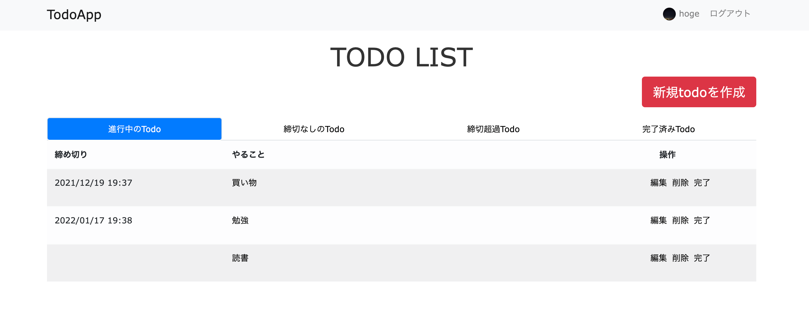
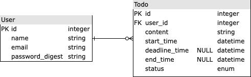

# TodoApp_v2について
本アプリケーションは、Ruby on Railsを学習した後に初めて1から作成したWebアプリです。Todoの追加、確認、編集、削除、完了等の操作ができる基本的なCRUDアプリになります。
  
以下の情報でログイン可能です。  
メールアドレス：hoge 
パスワード：hoge
 
- [アプリケーションURL](https://todo-deadline-management-app.herokuapp.com/todos)

## 実装機能について
実装されている機能に関しては以下のようになっています。
- メールアドレス、パスワードを利用したログイン機能。
- ユーザーにアバターを設定する機能。
- Todoを追加、確認、編集、削除できる機能。
- Todoを完了する機能。Todoはenumで状態管理されており、完了処理することで、完了済みTodoになります。

## データベース設計について
データベースの設計に関しては以下のER図の通りとなります。

## 使用した技術スタック
JavaScript, Ruby on Rails, PostgreSQL, Heroku, AWS S3

## 使用している主なgemについて
- Rspec：　Railsの代表的なテストツールの一つ。単体テスト、統合テストを実行するために使用しました。
- Factory Bot：　テストのサンプルデータを簡単に作成することができるgem。
- enum_help：　Railsでenum型を使用するのを補助するgem。
- aws-sdk-s3：　ユーザーのアバター画像をS3に保存するためのgem。
